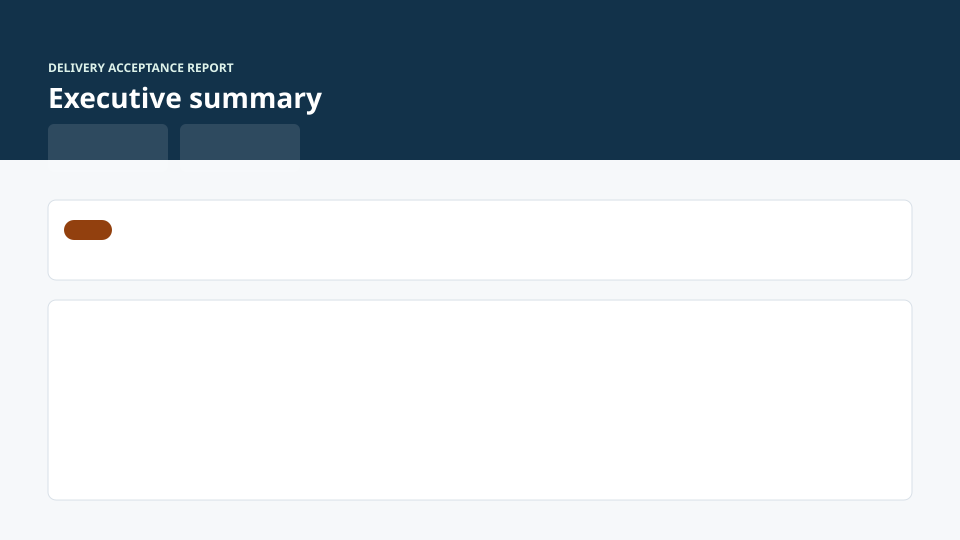

# AgentSkills Audit Collection

## In 30 seconds

**AgentSkills is a delivery acceptance system for AI-built websites** — not a prompt pack, not a link directory, not a Lighthouse replacement.

Paste a URL → see what works, what is untrustworthy, what blocks launch, and what to fix first — with **evidence**, **S0–S4 severity**, **copyable fix prompts**, and **retest steps**.

```bash
# Skills: copy .claude/skills/ into your project, then in Claude Code:
Use /audit to review https://example.com before launch.

# Workbench preview (this repo):
python3 -m http.server 8765
# Report UI:  http://localhost:8765/workbench/report/?demo=1
# Live UI:    http://localhost:8765/workbench/live/?demo=1
# Public report: reports/demo-site-audit.html or reports/latest-audit.html (after merge)
```

| Surface | What you see |
| --- | --- |
|  | Schema-driven issue cards + flow log |
|  | Stages/steps while `/audit` runs |
|  | Customer-facing HTML (from JSON) |

Replace SVG wireframes with PNGs: [docs/screenshots/README.md](docs/screenshots/README.md).

---

AI-generated products look finished before they are actually shippable.

This repo provides a Claude Code AgentSkills system for auditing AI-built websites, web apps, and vibe-coded products across:

- live workflows
- visual quality
- deployment readiness
- web surface discovery
- least-privilege live testing
- source vs live evidence
- `S0-S4` issue severity
- copyable fix prompts
- regression checks

It turns "looks done" into "tested, located, fixable, and retestable."

## Positioning

AgentSkills is an AI delivery acceptance system.

This is not a coding skill pack. It is closer to:

```text
QA department + acceptance workflow + risk audit + retrospective memory
```

The target question is not "can AI generate this?" The target question is:

```text
Can this AI-built product be trusted, fixed, retested, and delivered?
```

**Strategy & end-to-end flow:** [docs/vision-and-flow.md](docs/vision-and-flow.md) — positioning, goals, purpose, and how skills/workbench/reports fit together.

See [REQUIREMENTS.md](REQUIREMENTS.md) for the purpose and success criteria behind the collection.
See [PRODUCT.md](PRODUCT.md) and [DESIGN.md](DESIGN.md) for the product direction and design principles.

`DESIGN.md` follows the Google DESIGN.md shape: YAML design tokens for agents plus Markdown guidance for humans. Use it as the visual source of truth when generating audit workbench UI, screenshots, examples, or report surfaces.

## v0.1 Workbench Integration

This repo is consolidating from a skill collection into **AgentSkills Audit Workbench v0.1** — one schema, one severity standard, one validation pipeline.

| Resource | Purpose |
| --- | --- |
| [docs/v0.1-scope.md](docs/v0.1-scope.md) | Frozen MVP scope and milestones |
| [docs/skill-routing-map.md](docs/skill-routing-map.md) | `/audit` orchestrator + sub-skills |
| [docs/severity-standard.md](docs/severity-standard.md) | Canonical S0–S4 |
| [docs/evidence-levels.md](docs/evidence-levels.md) | SOURCE / LIVE / PHYSICAL / … |
| [docs/workbench-ui-spec.md](docs/workbench-ui-spec.md) | Scoped UI rules |
| [schemas/audit-report.schema.json](schemas/audit-report.schema.json) | Unified machine report |
| [validation/README.md](validation/README.md) | templates / cases / artifacts / golden |
| [workbench/README.md](workbench/README.md) | Local workbench (report + live viewers) |
| [workbench/report/](workbench/report/) | **Final report UI** — renders `audit-report.schema.json` |
| [workbench/live/](workbench/live/) | **Live audit UI** — polls `run-state.json` during `/audit` |
| [docs/gpt-recommendations-review.md](docs/gpt-recommendations-review.md) | GPT plan vs repo status |
| [docs/live-audit-workflow.md](docs/live-audit-workflow.md) | 实时工作流架构与案例研究 |
| [validation/golden/audit-report.example.json](validation/golden/audit-report.example.json) | Golden JSON for UI/render tests |
| [docs/m3-capture-workflow.md](docs/m3-capture-workflow.md) | M3 URL/screenshot/console capture |
| [scripts/audit_capture.py](scripts/audit_capture.py) | Write evidence to `validation/artifacts/<runId>/` |
| [scripts/audit_report_merge_run.py](scripts/audit_report_merge_run.py) | Sync `run-state.json` → `auditProgress` in report |
| [scripts/export_public_report.py](scripts/export_public_report.py) | Export public HTML from audit JSON |

### Semi-automated capture (M3)

```bash
./scripts/audit-run-init.sh https://example.com          # optional live run
./scripts/audit_capture.py https://example.com --run-dir validation/artifacts/<runId>
python3 scripts/audit_report_merge_run.py \
  --run-dir validation/artifacts/<runId> --merge-preview \
  --export-html reports/latest-audit.html
# With browser: pip install playwright && playwright install chromium
```

### Public HTML export (M4)

```bash
python3 scripts/export_public_report.py \
  --input validation/golden/audit-report.example.json \
  --output reports/demo-site-audit.html
```

## Research-Backed Rules

The collection now separates research input from shipped rules:

- Failure mode library: `.claude/skills/audit/references/failure-modes.md`
- Aesthetic metrics: `.claude/skills/visual-qa/references/aesthetic-metrics.md`
- Self-evolution roadmap: `docs/roadmap/self-evolving-audit-engine.md`
- Research source index: `docs/research/ai-product-audit-research-index.md`

Unverified site lists, popularity numbers, and ecosystem claims stay as research candidates until they have evidence-backed validation reports.

## Quick Start

1. Copy `.claude/skills/` into your Claude Code project.
2. Open Claude Code in the target repo or product workspace.
3. Ask:

```text
Use /audit to review this website before launch.
Target: <URL or local project>
Focus: workflows, visual QA, deployment readiness, and S0-S4 blockers.
```

For narrower checks:

```text
Use /flow-test to test every visible CTA, form, route, and failure state.
Use /physical-flow-test to generate executable Python Playwright tests for real-browser verification.
Use /visual-qa to inspect layout, trust, mobile behavior, and AI slop.
Use /deploy-check to find production blockers before launch.
Use /accept-five to repeat acceptance and turn findings into reusable rules.
```

Long audits should emit short progress updates as each major stage completes, then collapse those updates into the final evidence report.

Before live clicking, the audit flow maps the website surface and permission boundary:

```text
pages + interactions + media + documents + APIs + storage + security surfaces
    ->
permission level + SKIPPED-SAFE boundaries
    ->
safe live checks / physical browser tests / final report
```

## Public Report Surface

Skills are the audit engine. Public reports are the user-facing product surface.

Use `validation/templates/public-website-audit-report-template.md` (also at `validation/public-website-audit-report-template.md`) when turning an audit into a shareable website report. The report should show:

```text
problem -> evidence -> impact -> fix suggestion -> regression check
```

The first static report examples live in `reports/`:

- `reports/demo-site-audit.md`
- `reports/demo-site-audit.html`

## Workflow

```text
skill-study
    ->
harness
    ->
audit
    ->
flow-test / physical-flow-test / visual-qa / deploy-check
    ->
accept-five
    ->
agent-diagnose
    ->
rules memory / benchmark library
```

`/skill-study` is the external-learning entry point. `/harness` is the engineering delivery harness that decomposes business work and routes execution modes. `/audit` is the audit orchestrator. The other skills are focused task tools that can be called directly when a narrower pass is needed.

## Skills

- `/audit`: run the end-to-end website/product audit workflow.
- `/ai-product-audit`: audit AI-generated products for product-pattern fit, scenario clarity, and conversion readiness.
- `/skill-study`: learn from external skills, repositories, market skill reports, and competitor workflows without turning the collection into a basic curriculum.
- `/harness`: decompose business goals into multi-level execution steps with prompt/skill/Dify/RPA/code/human routing, checkpoints, retries, and escalation.
- `/flow-test`: test every visible feature and user workflow.
- `/physical-flow-test`: generate executable Python Playwright tests for real-browser workflow verification, artifacts, regression checks, and lessons.
- `/visual-qa`: audit visual craft, product taste, layout, responsive behavior, and AI slop.
- `/deploy-check`: inspect production readiness and missing runtime dependencies.
- `/accept-five`: run five-pass acceptance and accumulate lessons.
- `/agent-diagnose`: adversarially diagnose AI agent and workflow failure modes.

## Case Studies

The repository includes validation reports that stress-test the skills against real AI-built website examples and workflow claims.

Start with [CASE_STUDIES.md](CASE_STUDIES.md) for a short, readable summary of the strongest examples:

- API Checker: best visible interactive workflow benchmark.
- PhoneValidation.app: commercial micro-tool with pricing, credits, CSV upload, and data/privacy dependencies.
- Committed Citizens: clear CMS deployment gap in a real vibe-coded consulting site.
- impeccable.style: five-pass audit of an AI design tooling site.
- Global 200 source pass: a 200-candidate website audit dataset with explicit caveats.
- GitHub similar-projects benchmark: ecosystem positioning against agent skill libraries, audit skill marketplaces, workflow frameworks, DESIGN.md libraries, and browser automation tools.

## Structure

```text
.claude/skills/
  audit/SKILL.md
  audit/references/source-evidence.md
  audit/references/deployment-readiness.md
  audit/references/report-format.md
  audit/references/live-functional-audit.md
  audit/references/webpage-audit-rubric.md
  audit/references/aesthetic-quality-audit.md
  audit/references/failure-modes.md
  audit/references/five-pass-acceptance.md
  audit/references/progressive-reporting.md
  audit/references/permission-model.md
  audit/references/web-surface-discovery.md
  skill-study/SKILL.md
  skill-study/references/skill-benchmark-rubric.md
  skill-study/references/market-skill-radar.md
  harness/SKILL.md
  harness/references/business-decomposition.md
  harness/references/execution-router.md
  harness/references/checkpoint-retry-policy.md
  harness/references/process-agent-pattern.md
  flow-test/SKILL.md
  physical-flow-test/SKILL.md
  physical-flow-test/references/python-playwright-template.md
  physical-flow-test/references/artifact-schema.md
  physical-flow-test/references/safe-execution-policy.md
  physical-flow-test/references/locator-policy.md
  physical-flow-test/references/regression-lessons-ledger.md
  visual-qa/SKILL.md
  visual-qa/references/aesthetic-metrics.md
  deploy-check/SKILL.md
  accept-five/SKILL.md
  agent-diagnose/SKILL.md
  ai-product-audit/SKILL.md
  ai-product-audit/references/product-pattern-rubric.md
  ai-product-audit/references/category-pattern-catalog.md
docs/v0.1-scope.md      # frozen workbench MVP scope
docs/skill-routing-map.md
docs/severity-standard.md
docs/evidence-levels.md
docs/workbench-ui-spec.md
schemas/                # audit-report.schema.json
workbench/              # UI spec + component contracts (app in M2)
docs/research/          # research inputs and verification status indexes
docs/roadmap/           # future engine and self-evolution plans
CLAUDE.md
PRODUCT.md
DESIGN.md
examples/todo_cli/       # validation sample, outside the skills payload
examples/physical-flow-demo/ # tiny web app for physical browser verification examples
reports/                 # public-facing audit report examples
tests/                   # validation tests
validation/              # workflow proof artifacts
validation/templates/    # canonical report templates (v0.1)
validation/cases/        # golden case briefs
validation/golden/       # schema + public report examples
validation/artifacts/    # browser/tool evidence storage
validation/vibe-coded-site-verification-template.md # legacy path; see templates/
validation/github-similar-projects-benchmark-2026-05-22.md
validation/public-website-audit-report-template.md # legacy path; see templates/
```

## Design Principles

- Instruction-only skills: no bundled scripts.
- `CLAUDE.md` is the governance source of truth.
- Each skill is task-oriented, stateless, and independently callable.
- Physical browser tests are generated into target project artifacts; the skill itself remains instruction-only.
- Skill names describe real jobs, not basic curriculum.
- The agent should stay skeptical of source claims, weak evidence, broken workflows, visual slop, and deployment theater.
- Multi-step audits should show progress, evidence checkpoints, blockers, and next actions before the final report.
- Website audits should discover the web surface before detailed testing, then apply least privilege before live actions.
- External skills and trend reports are converted into audit checks, workflow triggers, benchmark labels, and guardrails, not copied as topic lists.
- Research materials must become evidence rules, candidate pools, or roadmap notes; unverified claims must not become case studies.
- Every skill must produce evidence that another person can understand, reproduce, fix, and retest.
- The public product surface is a report page; the skill files are the internal engine behind that report.
- If a skill only produces polished command names or vague opinions, it failed.
- Complex workflows must be decomposed into business stages and execution units before choosing prompt, skill, Dify, RPA, code, or human intervention.
- Automatic checkpoints, retry limits, fallbacks, and human escalation rules belong in the plan before execution starts.

## Unified Output Shape

Every skill should preserve this shape when applicable:

```text
1. Scope
2. Evidence
3. Findings
4. Severity
5. Reproduction
6. Fix Suggestion
7. Regression Check
8. Lessons
```

## Severity Scale

Canonical definition: [docs/severity-standard.md](docs/severity-standard.md).

| Level | Meaning |
| --- | --- |
| `S0` | Blocks launch or delivery |
| `S1` | Seriously hurts conversion, trust, correctness, privacy, or ops |
| `S2` | Noticeable issue; launch possible with known risk |
| `S3` | Polish / minor interaction |
| `S4` | Future enhancement |

## Validation

This repository includes completed validation runs under `validation/`, backed by a sample TODO CLI, a tiny physical-flow demo web app, batch case reviews for vibe-coded website examples, a global 200-site source-level audit batch, and a five-pass audit of `impeccable.style`.

Run the local validation sample with:

```bash
pip install -r requirements-dev.txt   # jsonschema for full report validation
python3 -m unittest discover -s tests
python3 scripts/validate_audit_report.py
python3 scripts/validate_skills.py
```

The TODO CLI is only a validation fixture. The skills themselves remain instruction-only and portable.
