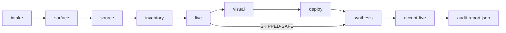

# Live Audit Workflow (实时检测 + 步骤标注)

Goal: while `/audit` runs, you **see which stage/step is active**, a **side annotation** of the current check, and findings accumulating — not only the final report.

## Research: What Good Patterns Look Like

| Source | Pattern | Borrow for AgentSkills |
| --- | --- | --- |
| [markdown-viewer/skills — BPMN](https://github.com/markdown-viewer/skills/tree/main/bpmn) | Swim-lane process notation; explicit gateways | Default audit pipeline stages + blocked/confirm branches |
| [markdown-viewer/skills — infographic](https://github.com/markdown-viewer/skills/tree/main/infographic) | Timeline / roadmap YAML templates | Stage rail UI in workbench |
| [markdown-viewer/skills — canvas](https://github.com/markdown-viewer/skills/tree/main/canvas) | Spatial nodes with state | Optional: map checks to page regions (M3+) |
| This repo — `progressive-reporting.md` | Chat `Progress Update [n/m]` | Human-readable trail in Claude/Cursor chat |
| CI systems (GitHub Actions, Buildkite) | Step log + live status JSON | **File-based `run-state.json` + NDJSON events** |
| Cursor `/loop` skill | Poll / wake on output | Workbench polls `run-state.json` every 1s |

markdown-viewer optimizes **rendering diagrams in Markdown**. AgentSkills optimizes **observable audit execution** — complementary, not competing.

## Architecture

```text
┌─────────────┐     append NDJSON      ┌──────────────────┐
│ Agent /audit│ ─────────────────────► │ run-events.ndjson │
│             │     rewrite atomic     └────────┬─────────┘
│             │ ─────────────────────►          │
└─────────────┘     run-state.json               │ poll 1s
                                                 ▼
                                        ┌──────────────────┐
                                        │ workbench/live/  │
                                        │  stage rail      │
                                        │  step timeline   │
                                        │  annotation      │
                                        │  findings rail   │
                                        └──────────────────┘
                                                 │
                                    completed ───┴──► audit-report.json
```

### Three channels (use all three)

1. **Chat** — `Progress Update [5/9] - Live functional audit` (existing format).
2. **run-state.json** — single source of truth for UI (stages, current step, annotation).
3. **run-events.ndjson** — append-only audit trail for replay/debug.

Skills stay **instruction-only**; the agent (or host `scripts/audit-run-*.sh`) writes files under `validation/artifacts/{runId}/`.

## Default Workflow (`audit-default-v1`)

| Order | Stage ID | Label | Sub-skill |
| --- | --- | --- | --- |
| 1 | `intake` | Intake & permissions | audit |
| 2 | `surface-discovery` | Web surface map | audit |
| 3 | `source-pass` | Source evidence | audit |
| 4 | `feature-inventory` | Feature inventory | audit |
| 5 | `live-functional` | Live functional test | flow-test |
| 6 | `visual-qa` | Visual / aesthetic QA | visual-qa |
| 7 | `deploy-check` | Deployment readiness | deploy-check |
| 8 | `synthesis` | Issue cards & report | audit |
| 9 | `accept-five` | Five-pass (optional) | accept-five |

Mark stage 9 `skipped` when user did not request five-pass.

## Agent Protocol

Full spec: [.claude/skills/audit/references/live-run-protocol.md](../.claude/skills/audit/references/live-run-protocol.md).

**On audit start:**

```bash
./scripts/audit-run-init.sh "https://example.com"
# → prints RUN_DIR and runId
```

**After each meaningful step:**

1. Update `run-state.json` (`currentStageId`, `currentStepId`, `activeAnnotation`, step status).
2. Append one line to `run-events.ndjson`.
3. Emit chat `Progress Update` (same facts).

**On complete:**

- Set `status: completed`, write `audit-report.json` into same folder.
- Point `run-state.reportPath` at final report.

## Workbench (local)

```bash
cd agentskills-audit-collection
python3 -m http.server 8765
# Open http://localhost:8765/workbench/live/?demo=1
# Or: ?state=validation/golden/audit-run.example.json
```

### Cursor Hooks (auto-open)

Project hooks in `.cursor/hooks.json`:

- `beforeSubmitPrompt` → `on-audit-prompt.sh` (detect `/audit`, 审计, etc.)
- `afterShellExecution` → `after-audit-run-init.sh` (matcher: `audit-run-init`)
- `postToolUse` → `post-audit-shell.sh` (reminds agent to update `run-state.json`)

Helper: `.cursor/hooks/open-live-workbench.sh` starts port **8765** and runs `open` / `xdg-open`.

## BPMN View (documentation)

Agents may emit this mermaid in chat or reports for stakeholders:



## Comparison to Alternatives

| Approach | Real-time UI | Complexity | Fits instruction-only skills |
| --- | --- | --- | --- |
| Chat-only progress | Weak | Low | Yes |
| **File poll (chosen v0.2)** | Good | Low | Yes |
| WebSocket server | Best | High | Needs host app |
| Markdown BPMN only | Static diagram | Low | Good for docs, not live |

## Related

- [schemas/audit-run.schema.json](../schemas/audit-run.schema.json)
- [workbench/live/README.md](../workbench/live/README.md)
- [progressive-reporting.md](../.claude/skills/audit/references/progressive-reporting.md)
