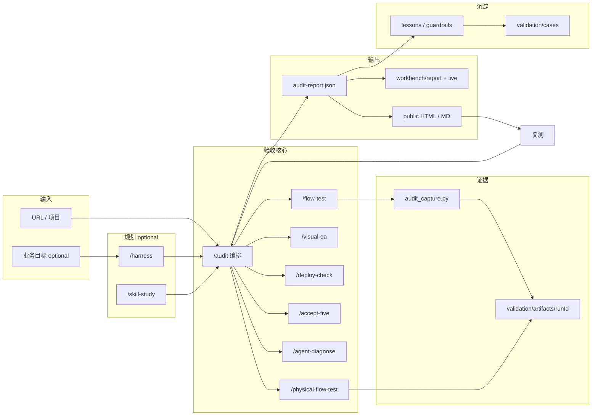

# AgentSkills：定位、目标与整体流程

本文档回答四个问题：**我们是谁、要解决什么、最终要达成什么、日常怎么跑**。与 [REQUIREMENTS.md](../REQUIREMENTS.md)（宪法）、[PRODUCT.md](../PRODUCT.md)（产品定义）、[v0.1-scope.md](v0.1-scope.md)（当前版本边界）一致。

---

## 0. 创始人初衷（产品北极星）

用一句话收束：

> **在审计过程中实时告诉用户「正在查哪一步」；用优秀网站案例对照说明「好应该长什么样」；同时验收 UI 审美、功能可用、安全、以及功能与数据是否真实可靠。**

拆成五条，也是对外讲产品时最该说的五件事：

| # | 初衷 | 用户感知 | 仓库里主要对应 |
| --- | --- | --- | --- |
| 1 | **UI 审美在线** | 不像 AI 模板；层级、留白、可信度过关 | `/visual-qa`、`DESIGN.md`、`aesthetic-metrics` |
| 2 | **功能可用** | 按钮、表单、主流程真能用 | `/flow-test`、`/physical-flow-test`、`audit_capture.py` |
| 3 | **检测时实时提示 + 附优秀案例** | 看着进度条/旁白知道在测什么；能看到对标站 | `workbench/live/`、`browser-extension/`（页内旁白）、`validation/cases/` |
| 4 | **审计安全** | 权限边界、敏感面、常见漏洞与误操作 | `permission-model`、`web-surface-discovery`、`failure-modes`、**v0.2：安全专章/issue 类型** |
| 5 | **全部功能与数据** | 功能不漏测；数据从哪来到哪去、是否泄露/造假 | feature inventory、deploy-check、**v0.2：data/privacy 检查清单** |

和「只做技能文档」的区别：**目标用户边看边懂**（实时 + 案例 + 报告），不是只给构建者一份 Markdown。

### 初衷 → 体验示意图

```text
目标用户打开验收页
  ├─ 左侧：当前阶段「正在测：定价页 CTA」     ← 实时（live workbench）
  ├─ 中间：步骤结果 + 截图/证据               ← artifacts
  ├─ 右侧：问题卡片 +「参考：PhoneValidation 定价区」 ← 案例对照（待加强）
  └─ 底部：安全 / 数据 / 部署 摘要             ← 四维验收（部分在 skill，待 UI 化）
```

---

## 1. 我们是什么（定位）

### 一句话定位

**AgentSkills 是面向 AI 生成网站/产品的「交付验收系统」**——在审计时**实时可见、案例可对照、审美+功能+安全+数据**四维可证，而不是 prompt 合集或网站收藏夹。

### 我们不是什么

| 不是 | 而是 |
| --- | --- |
| 教 AI 写代码的 coding skill pack | 教 AI **验** AI 做出来的东西能不能交付 |
| 设计灵感站 / 案例画廊 | 带证据的诊断台 + 可复测报告 |
| 单一自动化测试框架 | Skills（编排）+ Schema（契约）+ Workbench（可见）+ Artifacts（可复现） |

### 类比（对内对齐用）

```text
Vibe Coding 工具链  →  快速「做出来」
AgentSkills         →  证明「能不能交、哪里不可信、先修什么、怎么复测」
```

更接近：**QA 部门 + 验收流程 + 风险审计 + 经验沉淀**，而不是再多一个生成器。

### 首要受众（v0.1 押注）

1. **客户 / 业务方 / 协作者** — 需要看得懂的验收报告（能否上线、风险在哪）
2. **构建者 / 开发者** — 需要可执行的修复 prompt 与回归清单（其次）

---

## 2. 我们要解决什么问题（目标）

### 核心痛点

AI 做出来的网站和应用**看起来完成了**，但常常：

- 主流程没真跑通，或只看了静态页
- 视觉像「AI 模板」，缺乏可信的产品感
- 部署依赖（env、auth、DB、CMS、域名）没齐
- 问题描述模糊，无法复制到 Lovable / v0 / Cursor 去修
- 修完没有复测，同样问题反复出现

### 核心目标（可检验）

把 Vibe Coding 从：

```text
「看起来做完了」
```

变成：

```text
「逐步测过、有证据、有严重等级、能定位、能修复、能复测、能沉淀经验」
```

### 成功标准（什么叫「做成了」）

| 维度 | 标准 |
| --- | --- |
| 可理解 | 非技术人员 30 秒内看懂：能不能交付、最大风险 |
| 可证据 | 每个结论有 SOURCE / LIVE / PHYSICAL；缺的标 UNKNOWN，不硬编 |
| 可修复 | 每条 issue 有 severity、fix、copyable prompt、regression check |
| 可复用 | 同一 URL 再跑一遍，结论可对比；案例进 validation/cases |
| 可展示 | 内部 workbench + 对外 public report 同源（schema 驱动） |

---

## 3. 我们最终想达成什么（目的 / 终局）

### 产品终局（Workbench）

用户粘贴 **URL 或项目路径** 后，一眼看到：

1. 重要功能与流程清单
2. 哪些流程 PASS / FAIL / UNKNOWN / SKIPPED-SAFE
3. 视觉与「AI slop」问题（有依据，不是纯口味）
4. 部署就绪缺口（env、auth、DB、CMS…）
5. **先修什么**（S0–S4 + fix-first）
6. **可复制到构建工具**的修复包
7. 复测步骤与经验沉淀（lessons / guardrails）

### 工程终局（体系）

```text
Skills（怎么做审计）
  + Schema（审计结果长什么样）
  + Validation（模板 / 案例 / 证据库）
  + Workbench（审计过程可见、报告可读）
  + Scripts（半自动取证，不塞进 skill 目录）
```

### 战略边界（刻意不做）

- 不替代 Claude Code / Codex / Cursor **写代码**
- 不追求 OSWorld 式「操控整台电脑」（那是 Agent S 类路线）
- v0.1 不做全自动五轮、不做登录/支付破坏性自动化、不做 200 站批量无人值守

---

## 4. 整体流程（怎么跑）

### 4.1 宏观闭环



### 4.2 单次审计标准路径（默认）

| 步骤 | 做什么 | 产出 |
| --- | --- | --- |
| 0 | 明确目标 URL、权限边界（什么不能点） | Scope + SKIPPED-SAFE 列表 |
| 1 | 可选：`audit-run-init.sh` 开 live run | `run-state.json`（workbench/live 可见进度） |
| 2 | `/audit` 编排：表面发现 → 功能盘点 | feature inventory |
| 3 | `audit_capture.py` 或 `/physical-flow-test` | screenshots、console、result.json |
| 4 | `/flow-test` + `/visual-qa` + `/deploy-check` | flow log、visual findings、deploy checklist |
| 5 | 合并为 **audit-report.schema.json** | issueCards、copyableFixPack、regressionChecks |
| 6 | 导出 | workbench/report、export_public_report → 客户报告 |
| 7 | 可选 `/accept-five`、双 Agent 互审 | lessons、guardrail 更新 |
| 8 | 修复后 **复测** | 同一 regression check 变 passed |

### 4.3 双 Agent 互审（借鉴 Vibe Coding 视频，验收版）

不绑定 Codex CLI，在 Cursor / Claude Code 里固定角色即可：

| 轮次 | Agent A（规划/证据） | Agent B（挑刺） |
| --- | --- | --- |
| 计划 | 列 scope、功能表、安全边界 | 问：会不会把 UNKNOWN 当 PASS？ |
| 执行 | 跑 capture、填 schema | 问：证据等级够不够 PHYSICAL？ |
| 审查 | 写 issue cards + fix pack | 问：severity 是否统一 S0–S4？ |

交付物仍是 **JSON + artifacts + public report**，不是「两个模型都说 OK」。

### 4.4 与「做网站」工具链的关系

| 环节 | 典型工具 | AgentSkills 角色 |
| --- | --- | --- |
| 设计参考 | Pinterest / Mobbin / Land-book | 输入给 visual-qa，不内置 |
| 写代码 | Claude Code、Codex、Cursor | **被审计对象** 或跑 capture 的宿主 |
| 后端部署 | EdgeSpark、Vercel、Supabase | deploy-check 检查项 |
| 验收 | **AgentSkills** | 唯一专注「能不能交付」 |

---

## 5. 仓库内各层职责（一张表）

| 层级 | 路径 | 职责 |
| --- | --- | --- |
| 宪法 | `REQUIREMENTS.md` | 为什么存在、必须输出什么 |
| 产品 | `PRODUCT.md` | 用户承诺、核心循环 |
| 路由 | `docs/skill-routing-map.md` | `/audit` 唯一总入口，子 skill 分工 |
| 契约 | `schemas/audit-report.schema.json` | 机器可读验收报告 |
| 标准 | `docs/severity-standard.md`、`evidence-levels.md` | S0–S4、证据等级 |
| 执行 | `.claude/skills/*` | 仅 instruction，无脚本 |
| 取证 | `scripts/audit_capture.py`、`physical-flow-test` | 证据进 artifacts |
| 可见 | `workbench/live`、`workbench/report` | 过程 + 结果 UI |
| 对外 | `validation/templates/`、`export_public_report.py` | 客户报告 |
| 证明 | `validation/cases/`、`CASE_STUDIES.md` | benchmark 与案例 |

---

## 6. 初衷 vs 现状（诚实对照）

| 初衷维度 | v0.1 状态 | 缺口（建议 v0.2） |
| --- | --- | --- |
| UI 审美 | Skill + rubric 齐全；报告有 `visualFindings` | 报告里加「对标截图/链接」字段；自动抓首页图对比 |
| 功能可用 | flow-test + capture + 案例库 | 功能覆盖率 %；未测项强制 UNKNOWN |
| **实时提示** | `workbench/live` + 报告 `auditProgress` | 跑 `/audit` 时同步写 `run-state.json` 与报告摘要 |
| **优秀案例对照** | `benchmarkRefs` + `cases/index.json` | 公开 HTML「优秀网站对照」；issue 挂 `benchmarkCaseId` |
| **安全审计** | `securityReadiness` + skills | public 报告专章；后续可自动化 |
| **功能+数据全貌** | feature inventory + `dataReadiness` | 四维分：functional / visual / security / data |

---

## 7. 当前版本（v0.1）在整体中的位置

**v0.1 = 把「技能合集」收成「可执行的验收骨架」**，不追求全自动；**你的初衷里「实时 + 案例对照」已有一半（live UI + cases），需绑到同一条用户路径。**

已完成：统一 schema、severity、validation 三层、workbench 静态页、M3 capture、M4 public HTML、README 30 秒定位。

下一步（按初衷排序）：

1. **实时路径跑通**：`/audit` 时 `audit-run-init` → 结束跑 `audit_report_merge_run.py`（已支持）
2. **案例进报告**：issue / visual finding 可挂 `benchmarkCaseId`（如 `phonevalidation`）+ URL
3. **安全 + 数据专章**：audit-report schema 扩展或固定 checklist 区块
4. capture 合并进 `issueCards.evidence.artifacts`
5. 目标用户只看 public HTML 也能看到：进度摘要 + Top 对标 + 安全/数据摘要

---

## 8. 决策备忘（团队对齐用）

| 问题 | 结论 |
| --- | --- |
| 产品第一印象是什么？ | **像体检报告**：实时进度 + 四维（美/用/安/数）+ 优秀案例对照 |
| 先做开发者工具还是客户报告？ | **客户可读报告优先**；live workbench 给构建者/观众演示用 |
| 优秀案例放哪？ | 不进 skill 脚本；`validation/cases/` + 报告内链接，避免变成纯画廊 |
| 要不要接 Agent S？ | v0.1 **不接**；Web 验收用 Playwright + schema |
| 证据不够时怎么办？ | **UNKNOWN / SKIPPED-SAFE**，禁止静默省略 |
| 什么叫 delivery ready？ | 关键路径有证据 + 安全/数据无 S0–S1 未关闭项 |

---

## 相关链接

- [skill-routing-map.md](skill-routing-map.md)
- [v0.1-scope.md](v0.1-scope.md)
- [m3-capture-workflow.md](m3-capture-workflow.md)
- [workbench/README.md](../workbench/README.md)
